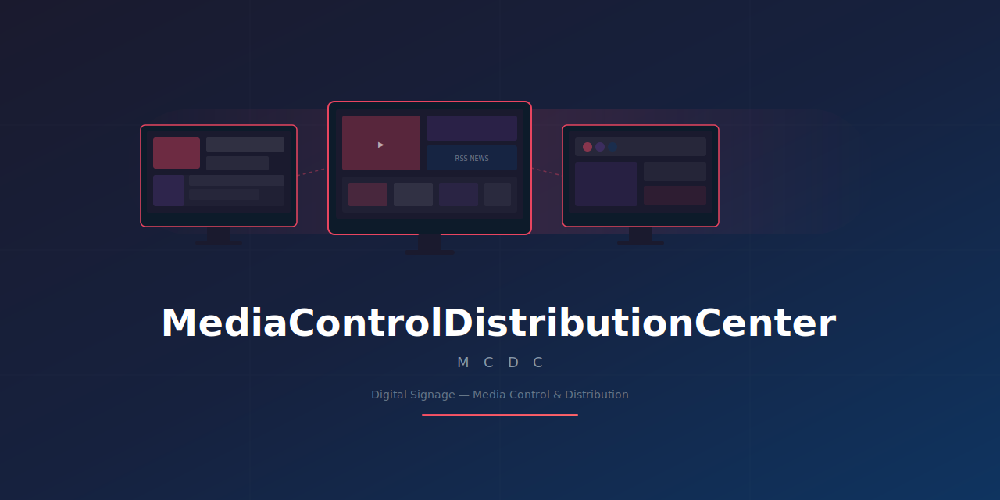

<p align="center">
  
</p>

<h1 align="center">MediaControlDistributionCenter (MCDC)</h1>

<p align="center">
  
  
  
  
  
  
</p>

<p align="center">
  <b>数字标牌媒体控制与分发中心</b> — 基于 WPF 的桌面控制台，创建、编排和分发数字标牌多媒体节目到远程显示器。
  <br>
  Digital Signage Media Control & Distribution Center — A WPF desktop console for creating, composing, and distributing digital signage programs to remote displays.
</p>

---

- [Features](#features)
- [Tech Stack](#tech-stack)
- [Architecture](#architecture)
- [Project Structure](#project-structure)
- [Getting Started](#getting-started)
- [Configuration](#configuration)
- [Connection Modes](#connection-modes)
- [Database](#database)
- [Troubleshooting](#troubleshooting)
- [Documentation](#documentation)
- [License](#license)

---

## Features

- **Dashboard** — Role-based overview: device status (total/connected/disconnected), recent devices, users, and programs.
- **Program Editor** — Visual canvas for media program composition:
  - **Component Types:** Image, Video, Rich Text, ColorText, RSS, Word/PDF, Web Page, IP Stream, HDMI
  - **Dual Engines:** Legacy WPF Canvas + GPU-accelerated **SkiaSharp** (configurable)
  - **Interaction:** Drag, resize, Z-order, property panel, multi-page with schedulers, animations
- **Device Management** — Register, group, manage displays. Remote brightness/volume/power control, scheduled tasks.
- **Media Management** — Full lifecycle: upload (FTP), CRUD, group organization, and publish to devices.
- **User & Role System** — Three tiers: **admin** (full), **agent** (manage users), **user** (own resources).
- **Playback Records** — Track and query playback history across devices.
- **Time Synchronization** — Configure time sync for devices.
- **Dual Connection Mode** — Remote (REST + JWT) or Local (SQLite + LAN/UDP). See [Connection Modes](#connection-modes).
- **Multi-Language** — 简体中文, English, 日本語, 한국어 with runtime switching.
- **Logging** — Serilog to Debug, Console, and rolling daily files.
- **Windows Integration** — DPI-aware, long path support, auto-firewall rule, admin elevation.

---

## Tech Stack

| Layer | Technology |
|---|---|
| Language | C# (.NET 8) |
| UI Framework | WPF (net8.0-windows) |
| MVVM Toolkit | CommunityToolkit.Mvvm 8.4 |
| UI Theme | MaterialDesignThemes 5.2 (Dark) |
| Canvas Rendering | SkiaSharp 4.148 + SkiaSharp.Views.WPF |
| ORM | SqlSugarCore 5.1 (primary), EF Core 9.0 (SQLite) |
| Database | SQLite |
| HTTP Client | System.Net.Http (REST + JWT) |
| File Transfer | FTP (custom client/server) |
| Mapping | AutoMapper 14.0 |
| Logging | Serilog 4.2 |
| PDF | PdfiumViewer |
| Document Rendering | Syncfusion DocIORenderer / PresentationRenderer \* |
| Video | WPFMediaKit, OpenCvSharp4 |
| WebView | Microsoft.Web.WebView2 |
| Serialization | Newtonsoft.Json 13.0.3 |
| Compression | SharpZipLib 1.4.2 |
| Windows Firewall | NetFwTypeLib (COM interop) |
| DI / Hosting | Microsoft.Extensions.Hosting / DI |

> \* Syncfusion is a commercial library — a license key is embedded in `App.xaml.cs`. Ensure proper licensing if redistributing.

---

## Architecture

```
MediaControlDistributionCenter.sln
├── MediaControlDistributionCenter         # WPF App (UI, ViewModels, Skia rendering)
├── MediaControlDistributionCenter.Services # Business logic — dual implementation:
│   ├── ApiImps/                            #   Remote REST API clients
│   └── LocalImps/                          #   Local SQLite-based implementations
├── MediaControlDistributionCenter.Data     # Data layer (entities, SqlSugar + EF Core)
└── MediaControlDistributionCenter.Utility  # Shared utilities
```

> **Note:** `MediaControlDistributionCenter.App`, `.Core`, `.Maui` exist as placeholders for future expansion.

### Rendering (SkiaSharp)

```
┌──────────────────────────────────────────────────┐
│            SkiaRenderEngine                      │
│        (GPU-accelerated render loop)             │
├──────────────────────────────────────────────────┤
│  IRenderable ──┬── ImageRenderable               │
│                 ├── VideoRenderable               │
│                 ├── TextRenderable                │
│                 ├── ColorTextRenderable           │
│                 ├── RssRenderable                 │
│                 ├── DocumentRenderable (Word/PDF) │
│                 ├── WebRenderable                 │
│                 ├── StreamRenderable              │
│                 └── HdmiRenderable                │
├──────────────────────────────────────────────────┤
│  AnimationEngine    (transitions & effects)      │
│  OverlayManager     (WPF overlays for video/Web) │
│  IComponentFactory  (renderable factory)         │
└──────────────────────────────────────────────────┘
```

---

## Project Structure

### WPF App

```
MediaControlDistributionCenter/
├── Rendering/                  # SkiaSharp engine
├── Views/Diagrams/             # Canvas editors (Skia + Legacy)
├── Views/DeviceManagement/     # Device pages
├── Views/MediaManagement/      # Media pages
├── Views/UserManagement/       # User pages
├── ViewModels/                 # Page / Component / Data VMs
├── Models/                     # UI models & configs
├── Services/                   # Detect, device interaction, localization
├── Converters/                 # Value converters
├── Themes/                     # MaterialDesign + language resources
└── Resources/                  # Localization assets
```

### Services Layer

```
Services/
├── ApiImps/                    # 14 service impls (remote, via REST+JWT)
├── LocalImps/                  # 12 service impls (local, direct SQLite)
├── DTO/Models/                 # AccountDto, MediaDto, ProgramDto, ...
├── IAuthService.cs             # 17 service interfaces
└── ServiceExtensions.cs        # DI registration (keyed: Local vs Remote)
```

### Data Layer

```
Data/
├── Entity/                     # 14 entities (User, Media, Monitor, Program, ...)
└── SQLite.cs                   # SqlSugar init + generic CRUD
```

### Utility Layer

```
Utility/Helpers/
├── Broadcast/                  # UDP broadcast for LAN device discovery
├── FTP/                        # Custom FTP client/server
├── Socket/                     # Socket communication layer
├── Tool/                       # Utility tools
├── EncryptionHelper.cs         # Encryption utilities
├── LanguageTool.cs             # Multi-language switching
├── StorageHelper.cs            # Storage management
├── VideoScreenCapture.cs       # OpenCV video frame capture
└── Constants.cs                # App-wide constants
```

---

## Getting Started

### Visual Studio
1. Open `MediaControlDistributionCenter.sln`
2. Restore NuGet packages
3. Press **F5**

### .NET CLI
```bash
git clone <repo-url>
cd MediaControlDistributionCenter
dotnet restore
dotnet build -c Release
dotnet run --project MediaControlDistributionCenter
```

### Default Login

| Mode | Account | Password |
|---|---|---|
| Local | `admin` | `123456` |
| Remote | per server config | per server config |

---

## Configuration

Edit `MediaControlDistributionCenter/appsettings.json`:

```json
{
  "Serilog": {
    "MinimumLevel": "Debug",
    "WriteTo": [
      { "Name": "Debug" },
      { "Name": "Console" },
      { "Name": "File", "Args": { "path": "logs/mcdc-log-.log", "rollingInterval": "Day" } }
    ]
  },
  "ConnectionMode": {
    "ServiceUri": "http://1.255.226.145:12106"
  },
  "FtpConnection": {
    "IpAddress": "",
    "Port": 9938,
    "UserName": "admin",
    "UserPassword": "admin",
    "BasePath": ""
  },
  "SkiaCanvas": {
    "Enabled": true,
    "UseSkiaPreview": true,
    "UseSkiaEditor": true
  }
}
```

> Serilog full config also includes `Using`, `Enrich: [FromLogContext, WithMachineName]`, and `Properties: {Application}`. The original `appsettings.json` also has alternate server addresses (`http://47.102.47.221:12106`, `http://47.102.47.221:9000`) commented out under `ConnectionMode.ServiceUri` and `FtpConnection.IpAddress`.

| Key | Note |
|---|---|
| `ConnectionMode.ServiceUri` | Backend API endpoint (remote mode) |
| `FtpConnection.*` | **Change credentials in production**; also accepts `IpAddress` / `BasePath` |
| `SkiaCanvas.Enabled` | `false` to fall back to legacy WPF Canvas |
| `SkiaCanvas.UseSkiaPreview` / `UseSkiaEditor` | Toggle Skia per view independently |

---

## Connection Modes

Toggled via radio buttons on the **Login** screen:

| Mode | Default | Backend | Auth | Discovery |
|---|---|---|---|---|
| **Remote** | Yes | REST API + JWT | Server accounts | Internet |
| **Local** | No | SQLite (local) | Built-in user DB | UDP broadcast (LAN) |

In **Local** mode, devices on the same LAN are auto-discovered via UDP broadcast and communicate directly through FTP/Socket — no backend server required.

---

## Database

- **Engine:** SQLite, file `DebugData.db` created at runtime (working directory).
- **Strategy:** Code-first — tables auto-created via SqlSugar from entity classes.
- **Default seed:** Admin user (`admin` / `123456`).
- **ORM:** SqlSugarCore (primary CRUD) + EF Core (`AppDbContext`) for query scenarios.

---

## Troubleshooting

| Problem | Solution |
|---|---|
| Skia canvas crashes | Set `SkiaCanvas.Enabled: false` in config to use legacy canvas |
| Login "connection refused" | Switch to **Local** mode, or check `ServiceUri` |
| WebView2 blank | Install [WebView2 Runtime](https://developer.microsoft.com/microsoft-edge/webview2/) |
| Package restore fails | Verify NuGet source includes `nuget.org` |
| Admin prompt on every launch | Expected — the app requires **administrator elevation** (`requireAdministrator` in app.manifest) for Windows Firewall rule management |
| FTP upload fails | Verify FTP server; default `admin`/`admin` is dev-only |

---

## Documentation

- **[SkiaCanvas Migration Plan](docs/SkiaCanvas%20Migration%20Plan.md)** — Chinese-language doc on the WPF-to-SkiaSharp migration (5 phases, ~95% complete).

---

## License

Copyright © 山木时代. All rights reserved.

Proprietary — Confidential. Not for reproduction, distribution, or use without written permission.

---

*Last updated: 2026-07-02*
